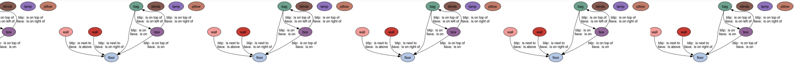
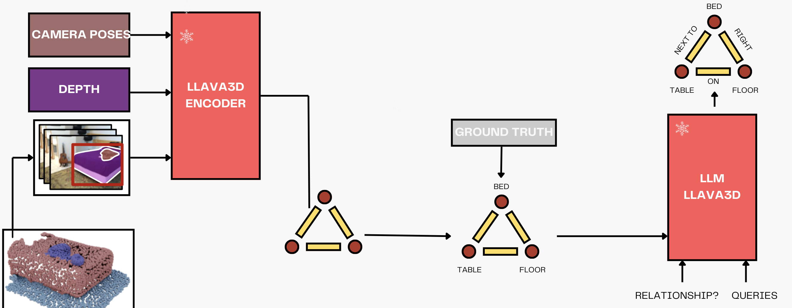
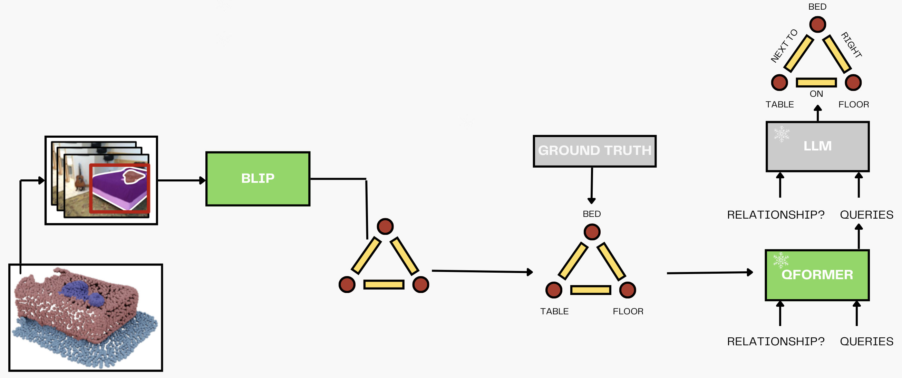

<h6 align="center"> P3DCV - TUM</h6>



<br>
<p align="center">
<h1 align="center"><strong>Open-Vocabulary 3D Scene Understanding: A Modified LLaVA-3D Approach</strong></h1>
  <p align="center">
	<br>
    <a href='https://github.com/NoahLodes' target='_blank'>Noah Lodes</a>&emsp;
	  <a href='https://github.com/SebastianBoessl' target='_blank'>Sebastian Bößl</a>&emsp;
    <a href='https://github.com/elenaalegret' target='_blank'>Elena Alegret</a>&emsp;
    <a href='https://github.com/Ayaka-mogumogu' target='_blank'>Ayaka Nanri</a>&emsp;
    <br>
    The University of Munich
    <br>
  </p>
</p>

<div style="text-align: justify;">
We aim to refine scene object relationships by enhancing 3D spatial awareness, building on top of <strong>Open3DSG</strong> for open-vocabulary 3D scene graph generation. Our project explores two different approaches to further improve relationship inference.
<ul>
  <li>
  <strong>Approach 1 – LLaVA-3D:</strong> Camera poses, depth, and RGB images are fused by the LLaVA3D encoder to produce 3D-aware embeddings and build a scene graph. The LLM then uses both ground-truth annotations and inferred relationships to answer spatial queries about the environment.
  </li>

  <li>
  <strong>Approach 2 – BLIP:</strong> BLIP extracts visual embeddings from the RGB input for 3D scene graph generation, while the Q-Former refines these embeddings for fine-grained relational queries. The LLM then incorporates both the graph and ground-truth data to answer spatial questions about the scene.
    </li>
  </ul>
</div>

## Model Architecture
<div align="center">
  <figure style="display:inline-block; margin-right:20px; text-align:center;">
    
    <figcaption>Figure 1: LLaVA-3D Approach 1 Architecture</figcaption>
  </figure>

  <figure style="display:inline-block; text-align:center;">
    
    <figcaption>Figure 2: BLIP Approach 2 Architecture</figcaption>
  </figure>
</div>


## Installation
Environment Requirements:
* Python 3.10
* Pytorch 2.1.0
* CUDA Version 11.8

Setup Steps

1. Clone the repository

```bash
git clone git@github.com:NoahLodes/LLaVA-3D.git
cd LLaVA-3D
```

2. Install Dependencies

```Shell
conda create -n llava-3d python=3.10 -y
conda activate llava-3d
pip install torch==2.1.0 torchvision==0.16.0 torchaudio==2.1.0 --index-url https://download.pytorch.org/whl/cu118
pip install torch-scatter -f https://data.pyg.org/whl/torch-2.1.0+cu118.html
pip install -e .
```

3. Download Camera Parameters File

Retrieve the [Camera Parameters File](https://drive.google.com/file/d/1a-1MCFLkfoXNgn9XdlmS9Gnzplrzw7vf/view?usp=drive_link) and place the JSON in `./playground/data/annotations`.

4. Install Additional Packages (for Training)

```Shell
pip install -e ".[train]"
pip install flash-attn --no-build-isolation
```

5. Obtain Model Checkpoints

Pre-trained checkpoints for LLaVA-3D are available on [here](https://huggingface.co/ChaimZhu/LLaVA-3D-7B). Currently, only the 7B model is provided.


## Run

You may run the demonstration using the `llava/eval/run_llava_3d.py` script. For 3D tasks, specify the relevant data with the `--video-path` parameter. A sample scene is available [here](https://huggingface.co/datasets/ChaimZhu/LLaVA-3D-Demo-Data); download it and place it in `./demo` before executing the following command:

```bash
python llava/eval/run_llava_3d.py \
    --model-path ChaimZhu/LLaVA-3D-7B \
    --video-path ./demo/scannet/scene0356_00
```
## Acknowledgments

We build upon the work of [LLaVA-3D](https://zcmax.github.io/projects/LLaVA-3D/) and [ODIN](https://github.com/boschresearch/Open3DSG).
